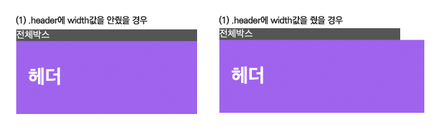
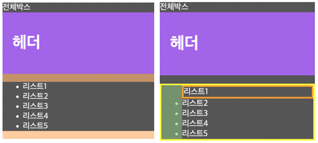

# [22.09.13] Today I Learned

## 오늘의 공부
* CSS 2차 과제 - 버킷리스트 만들기(html/css)

## Problem & Trouble Shooting   

### 1. 블록 레벨 요소   

   

### code

```html
<div class="wrapper">
  <div class="header">
    <h1>헤더</h1>
  </div>
</div>
```

```css
.wrapper {
    width: 400px;
    background-color: #555555;
  color: #fff;
}

.header {
    padding: 20px;
    background-color: violet;
}
```

### Problem
  - 자식요소인 .header에 width값을 주게되면 부모요소인 .header보다 넘치게 되는 현상

### Why?
  - 자식요소인 .header에 width값을 주지 않으면 `width:auto`가 되며, `width:auto`의 의미는 부모요소인 .wrapper가 제공하는 사용가능한 공간의 크기만큼 header가 가득차게 된다는 것! 나는 .header에 padding값까지 주었기때문에 header에 `width: 300px`, `padding: 20px`까지 줘서 총 340px이 됐다

### Trouble Shooting
  - 자식요소의 width값이 부모요소의 width값 보다 클 경우 부모요소를 넘어가게 된다
  - width값에 padding과 margin값이 추가되어 크기가 커지기 때문에, 정확히 내가 원하는 width값만 적용하고 싶은 경우에는 `box-sizing: border-box;`를 주는 것이 좋다 (하지만 그럴바에는 `width:auto` 사용하는게 훨씬 행복함!)


### 2. `<ul>` 태그의 기본값

### Problem
  - 리스트 목록 작업 중 브라우저에서 <li> 요소들이 오른쪽으로 치우쳐있는 것을 발견했다
  - 왼쪽에 list-style이 들어가는 것을 고려해서라고 해도 따로 컨트롤 할 수 없는지 궁금해졌다
  
### Why?
  - 이유는 브라우저에서 기본적으로 지정해둔 스타일에 있었다. [MDN목록스타일링](https://developer.mozilla.org/ko/docs/Learn/CSS/Styling_text/Styling_lists)에도 명시되어 있고, 개발자도구로도 확인이 가능하다  
  - 기본값으로 `margin-right: 1em;`, `margin-left: 1em;`, `padding-left: 40px;`이 주어져있다

        

### Trouble Shooting
  - list-style을 없애고, 기본값을 모두 초기화시키고 싶다면 `list-style-type: none;`과 `margin: 0;`, `padding: 0;`을 주면 된다

## Learned
  - 리스트를 감싸고 있는 박스 안에서 리스트들을 가운데 정렬하려면 padding을 활용하자
  - `<li>` 요소에 margin을 넣어주는 경우, `<ul>` 요소의 padding값과 합쳐진다

## Try
 - 더 다양한 예제 만들어보며 배운 내용 적용하기(마진병합, position 속성 등)
 - 필기한 내용을 바탕으로 추가적인 공부가 더 필요하다